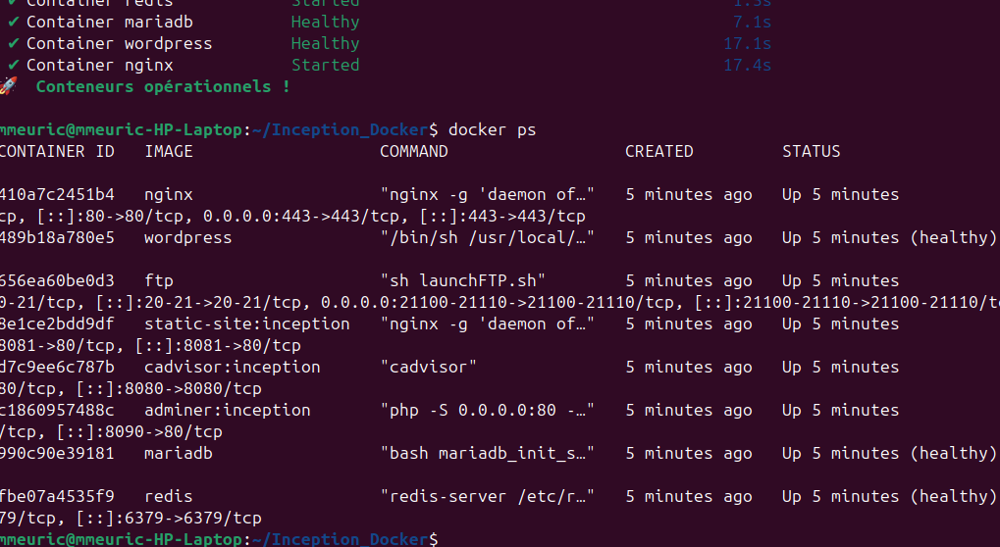
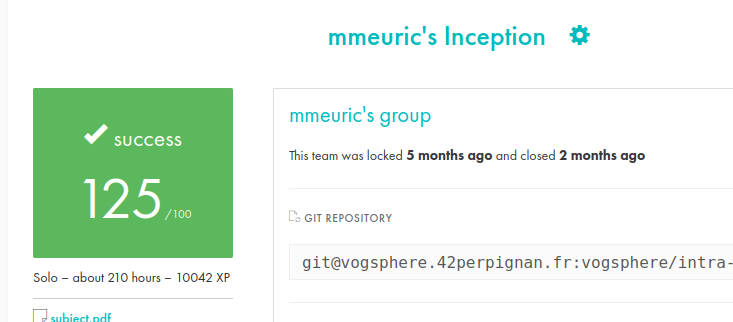

# 🐳 Inception

*A system-administration project using Docker & container orchestration*

This project is part of the 42 curriculum and focuses on building a complete, secure, and reproducible server infrastructure using **Docker**, **Docker Compose**, and custom **Dockerfiles**.
All services run in dedicated containers and communicate through a custom Docker network inside a virtual machine.
👉 **I also completed the full bonus section**, adding Redis, FTP, a static website, Adminer, and cAdvisor.

---

## 🚀 Project Overview

The goal of **Inception** is to design and deploy a modular container-based infrastructure.
Every service is built **from scratch** (Alpine/Debian) using your own Dockerfiles.

### 📸 Screenshot


---



---

My setup includes:

### ✅ Mandatory services

* **NGINX (TLS 1.2/1.3)** — secure entry point
* **WordPress + PHP-FPM** — running without NGINX inside the container
* **MariaDB** — database server
* **Docker volumes**

  * WordPress database
  * WordPress site files
* **Environment variables & secrets**
* **Custom Docker network**
* **Automatic restart policies**

### ⭐ Bonus services (all completed)

* **Redis Cache** — improves WordPress performance
* **FTP Server** — access WordPress files remotely
* **Static Website** — simple showcase page
* **Adminer** — database management UI
* **cAdvisor** — container monitoring dashboard

---

## 🏗️ Project Structure

```
Inception_Docker/
├── Makefile
├── clean_docker.txt
├── test.sh
├── test.txt
├── wp-config.php
└── srcs/
    ├── docker-compose.yml
    └── requirements/
        ├── mariadb/
        │   ├── Dockerfile
        │   └── conf/
        │       ├── 50-server.cnf
        │       └── mariadb_init_script.sh
        ├── nginx/
        │   ├── Dockerfile
        │   └── conf/nginx.conf
        ├── wordpress/
        │   ├── Dockerfile
        │   └── conf/
        │       ├── launchWP.sh
        │       └── www.conf
        └── bonus/
            ├── 1_redis/
            ├── 2_ftp/
            ├── 3_static_website/
            ├── 4_adminer/
            └── 5_cadvisor/
```

Each folder includes its own **Dockerfile**, configuration, and tools.

---

## ⚙️ How to Run

```bash
make all    # Build and launch all containers
make down   # Stop and remove containers
make clean  # Delete images, volumes, networks
```

Once everything is up:

```
https://mmeuric.42.fr
```

---

## 📚 What I Learned

This project strengthened my skills in:

* Containerization with Docker
* Writing clean and secure Dockerfiles
* Docker Compose orchestration
* NGINX HTTPS setup (TLS 1.2/1.3)
* Database configuration (MariaDB)
* PHP-FPM optimization
* Using volumes, networks, and secrets
* Debugging multi-service infrastructures
* Extending systems with optional services (Redis, FTP, Adminer, cAdvisor…)

---

## My final grade :


